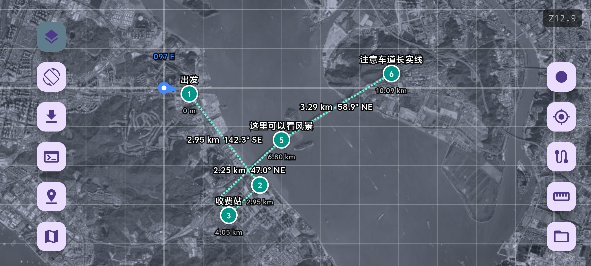

# Navi - 户外卫星地图与轨迹记录

基于 Flutter 的离线卫星地图定位应用，支持轨迹录制、路径点规划、距离测量。



## 技术栈

Flutter 3.x / flutter_map / geolocator / flutter_device_compass / latlong2

## 快速开始

```bash
flutter pub get
flutter run
```

## 开发流程

```bash
# 提交前本地执行
flutter analyze
flutter test

# CI 仅做构建（APK + Windows），不执行 analyze/test
git push
```

## 项目结构

```
lib/
├── main.dart       # 入口与主页面
├── common.dart     # 模型与工具函数
├── painters.dart   # 自定义绘制
├── tiles.dart      # 瓦片源与下载
└── track_io.dart   # 轨迹文件 I/O
```

## 注意

ArcGIS / ESRI Clarity 使用 WGS-84 坐标，与 GPS 一致；高德卫星图因 GCJ-02 偏移已移除。
